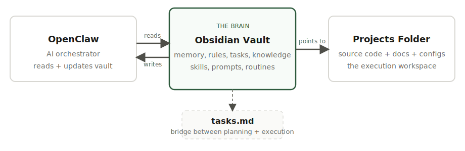

# 🧠 OpenVault

**[open-vault.dev](https://open-vault.dev)**

*Architecture & Reference Guide*

*A Brain-Inspired Knowledge Management System for AI Agent Orchestration, Task Execution & Memory*

> Version 5.0 | February 2026

---

## Overview: The Brain-Vault Analogy

This Obsidian vault serves as the central nervous system for OpenClaw — an AI orchestration platform that manages tasks, automations, and knowledge. Each folder in the vault maps to a functional region of the human brain, creating an intuitive architecture for how information flows, gets processed, stored, and acted upon.

The vault is designed so that both humans and AI agents can navigate it naturally. Folders are numbered (000–130) to maintain consistent sort order across file browsers, CLI tools, and agent file access.

### Master Folder Map

| Folder          | Brain Region            | Core Function                                         |
|---------------------|-----------------------------|-----------------------------------------------------------|
| 000-Inbox       | Sensory Input               | Raw captures, unsorted notes, clippings before processing |
| 010-Projects    | Prefrontal Cortex           | Executive planning, active project management             |
| 015-Dashboard   | Thalamus                    | Central routing, system status, daily briefing            |
| 020-Tasks       | Working Memory              | Immediate task tracking: today, upcoming, someday         |
| 025-Watchlist   | Reticular Activating System | Attention filtering, alerts, monitors, feeds              |
| 030-Agents      | Neural Pathways             | Agent configs, logs, templates, and memory                |
| 035-Priorities  | Amygdala                    | Urgency tagging and priority classification               |
| 040-Skills      | Cerebellum                  | Procedural memory: reusable skills and commands           |
| 050-MCP         | Synapses                    | MCP server connections, tools, resources                  |
| 060-Prompts     | Neocortex                   | Higher reasoning: system prompts, chains, fragments       |
| 070-Routines    | Autonomic NS                | Automatic + scheduled + triggered workflows               |
| 080-Bookmarks   | Temporal Lobe               | Reference storage: links, articles, tools                 |
| 090-Knowledge   | Long-term Memory            | Domain knowledge: engineering, trading, devops, health    |
| 095-Connections | Corpus Callosum             | Cross-linking, maps of content, tag indexes               |
| 100-Context     | Prefrontal Context          | CLAUDE.md files, rules, personas, scratchpads             |
| 110-Logs        | Hippocampus                 | Episodic recording: daily, weekly, decisions, agent runs  |
| 120-Templates   | DNA / Blueprints            | Replicable patterns for all vault content types           |
| 130-Archive     | Deep Storage                | Retired content preserved for reference                   |

### 000-Inbox — Sensory Input

**Brain Analogy:** Just as the brain receives raw sensory data from the eyes, ears, and skin before routing it to specialized regions, the Inbox captures all unprocessed input before it gets organized.

This is the default landing zone for anything captured quickly — ideas, links, screenshots, voice memos, clippings from the web, or quick notes you jot down on the go. Nothing lives here permanently; it gets triaged into the appropriate folder during regular processing.

**Best Practices**

- Process the Inbox at least once daily (or set up an agent to auto-triage)

- Keep items here less than 48 hours

- Use the routing-rules.md in 015-Dashboard to define where items should go

### 010-Projects — Prefrontal Cortex (Executive Function)

**Brain Analogy:** The prefrontal cortex handles planning, decision-making, and executive function — the highest-order thinking. This is where complex, multi-step initiatives are managed.

Each project gets its own subfolder under Active, On-Hold, or Completed. Projects contain everything needed to execute: an overview, task lists, phase breakdowns, logs, and reference materials.

**Structure**

| File / Subfolder    | Purpose                                                  |
|-------------------------|--------------------------------------------------------------|
| Active/                 | Projects currently being worked on                           |
| ProjectName/overview.md | Project summary: goals, scope, stakeholders, timeline        |
| ProjectName/tasks.md    | Project-specific task list with status tracking              |
| ProjectName/phases/     | Phase breakdowns (e.g., phase-1-design.md, phase-2-build.md) |
| ProjectName/logs/       | Project-specific activity logs and meeting notes             |
| ProjectName/references/ | Supporting docs, links, specs relevant to this project       |
| On-Hold/                | Projects paused but not abandoned                            |
| Completed/              | Finished projects preserved for reference                    |

### 015-Dashboard — Thalamus (Central Router)

**Brain Analogy:** The thalamus acts as the brain’s central relay station, routing sensory information to the correct cortical regions for processing. The Dashboard serves the same role for the vault.

This is the nerve center of the vault. It provides at-a-glance system status, tells OpenClaw what to focus on, generates daily briefings, and defines the rules for how Inbox items get routed to the right folders.

**Files**

| File / Subfolder | Purpose                                                             |
|----------------------|-------------------------------------------------------------------------|
| system-status.md     | Health status of all automations, agents, backups, and cron jobs        |
| active-focus.md      | What OpenClaw should prioritize RIGHT NOW — the current directive       |
| daily-brief.md       | Auto-generated morning summary: tasks due, alerts, calendar, priorities |
| routing-rules.md     | Rules defining how Inbox items get auto-sorted into folders             |

### 020-Tasks — Working Memory

**Brain Analogy:** Working memory in the prefrontal cortex holds the items you’re actively thinking about — typically 4–7 items at a time. This folder is the vault’s immediate task register.

Unlike 010-Projects (which are large, multi-phase efforts), Tasks are individual action items that need to be done. The tasks.md file uses the OpenClaw task tracker format with status emojis, timestamps, and agent attribution.

**Files**

| File / Subfolder | Purpose                                                 |
|----------------------|-------------------------------------------------------------|
| today.md             | Tasks that must be completed today                          |
| upcoming.md          | Tasks scheduled for the near future (this week / next week) |
| someday.md           | Ideas and tasks with no firm deadline — the backlog         |

### 025-Watchlist — Reticular Activating System

**Brain Analogy:** The RAS filters thousands of incoming signals and decides what deserves conscious attention. It’s why you notice your name in a crowded room. The Watchlist defines what OpenClaw should be alert to.

This folder holds everything that needs passive monitoring. Rather than requiring active work, these items trigger attention only when specific conditions are met.

**Structure**

| File / Subfolder | Purpose                                                                       |
|----------------------|-----------------------------------------------------------------------------------|
| Alerts/              | Active alert conditions and thresholds (e.g., price drops below \$X, HRV below Y) |
| Monitors/            | Things being tracked: stock prices, health metrics, project deadlines, uptimes    |
| Feeds/               | RSS feeds, API endpoints, data streams, and webhooks to watch                     |

### 030-Agents — Neural Pathways

**Brain Analogy:** Neural pathways are the brain’s wiring — established routes that carry signals between regions. Agents are the vault’s active processes: defined, configured, and capable of independent execution.

This folder defines WHO does the work. Each agent has a configuration, produces logs, and can draw on persistent memory. The Memory subfolder uses a brain-inspired split between working, episodic, and semantic memory.

**Structure**

| File / Subfolder | Purpose                                                            |
|----------------------|------------------------------------------------------------------------|
| Configs/             | Agent definitions: system prompts, personas, tool access, capabilities |
| Logs/                | Agent run history: what they did, when, and results                    |
| Templates/           | Reusable agent templates for spinning up new agents quickly            |
| Memory/Working/      | Current session context and scratchpads — clears regularly             |
| Memory/Episodic/     | Records of specific events and interactions over time                  |
| Memory/Semantic/     | Consolidated facts, learned patterns, permanent knowledge              |

### 035-Priorities — Amygdala (Urgency Tagging)

**Brain Analogy:** The amygdala tags experiences with emotional weight so the brain knows what deserves immediate attention versus what can wait. The Priorities folder does the same for tasks and projects.

This is the vault’s triage system. Agents can auto-classify items using the rules defined in priority-rules.md, and humans can override at any time.

**Files**

| File / Subfolder | Purpose                                                    |
|----------------------|----------------------------------------------------------------|
| critical.md          | 🔴 Must act immediately — blockers, failures, urgent deadlines |
| high.md              | 🟠 This week — important but not emergency                     |
| normal.md            | 🟡 Scheduled and on track — proceeding as planned              |
| low.md               | 🟢 Backlog — nice to have, no deadline pressure                |
| priority-rules.md    | Rules for how agents should auto-classify urgency levels       |

### 040-Skills — Cerebellum (Procedural Memory)

**Brain Analogy:** The cerebellum stores procedural memory — learned patterns like riding a bike or typing. Once learned, they execute automatically. Skills are the vault’s reusable capabilities.

Skills define WHAT agents can do. They’re reusable, composable, and can be shared across agents and tools. The skill-index.md acts as a manifest so agents can discover available capabilities.

**Structure**

| File / Subfolder  | Purpose                                                   |
|-----------------------|---------------------------------------------------------------|
| Claude-Code/Commands/ | Reusable slash commands and code snippets for Claude Code     |
| Claude-Code/Hooks/    | Pre/post hooks and event handlers for Claude Code workflows   |
| OpenClaw/             | OpenClaw-specific skill definitions and capability files      |
| Shared/               | Skills usable across any agent or tool — platform-agnostic    |
| skill-index.md        | Registry of all available skills with descriptions and status |

### 050-MCP — Synapses (Connections)

**Brain Analogy:** Synapses are the junctions between neurons where signals pass from one to another. MCP (Model Context Protocol) is the communication layer that connects agents to external tools and data sources.

This folder holds the configuration for all MCP servers, custom tool definitions, resources, and prompt templates that agents can access. The mcp-registry.md provides a single pane of glass for everything connected.

**Structure**

| File / Subfolder | Purpose                                                                    |
|----------------------|--------------------------------------------------------------------------------|
| Servers/             | MCP server configs and connection details (filesystem, GitHub, Obsidian, etc.) |
| Tools/               | Custom tool definitions exposed via MCP to agents                              |
| Resources/           | MCP resource definitions — data sources agents can read                        |
| Prompts/             | MCP prompt templates served to connected clients                               |
| mcp-registry.md      | Master index of all MCP servers, their tools, and capabilities                 |

### 060-Prompts — Neocortex (Higher Reasoning)

**Brain Analogy:** The neocortex handles abstract thinking, language, reasoning, and synthesis — the most sophisticated cognitive functions. Prompts are the instructions that direct this higher-order processing.

Separated from agent configs because prompts are composable and reusable across agents. Chains define multi-step workflows, and Fragments are mix-and-match pieces that can be assembled into larger prompts.

**Structure**

| File / Subfolder | Purpose                                                          |
|----------------------|----------------------------------------------------------------------|
| System/              | System prompts and CLAUDE.md files that define agent behavior        |
| Task/                | Reusable task-specific prompts (e.g., summarize, analyze, generate)  |
| Chains/              | Multi-step prompt chains and workflows (research → summarize → file) |
| Fragments/           | Composable prompt snippets and partials for assembly                 |

### 070-Routines — Autonomic Nervous System

**Brain Analogy:** The autonomic nervous system controls automatic bodily functions: heartbeat, breathing, digestion. You never think about them, but they’re always running. Routines are the vault’s background processes.

This folder is split into conscious (scheduled, triggered) and unconscious (autonomic) processes, mirroring the brain’s separation of voluntary and involuntary actions.

**Structure**

| File / Subfolder | Purpose                                                                              |
|----------------------|------------------------------------------------------------------------------------------|
| Autonomic/           | Always-on processes that never need attention: backups, syncs, heartbeats, health checks |
| Scheduled/           | Cron jobs and weekly tasks — you set them, they execute on a timer                       |
| Triggered/           | Event-driven rules: when X happens, do Y (e.g., TradingView alert → log)                 |
| Pipelines/           | Multi-step orchestrated workflows that chain multiple actions                            |
| Checklists/          | Manual routines and SOPs: daily standup, weekly review, monthly audit                    |

### 080-Bookmarks — Temporal Lobe (Reference Storage)

**Brain Analogy:** The temporal lobe processes and stores long-term reference information including language and patterns. Bookmarks store curated external references organized by type.

**Files**

| File / Subfolder | Purpose                                                         |
|----------------------|---------------------------------------------------------------------|
| tools.md             | Software, SaaS products, CLIs, and utilities you use or want to try |
| articles.md          | Saved articles, blog posts, and long-form reads worth keeping       |
| repos.md             | GitHub repositories and open-source projects of interest            |
| tutorials.md         | How-to guides, courses, and learning resources                      |
| reference-sites.md   | Frequently visited documentation sites and reference portals        |

### 090-Knowledge — Long-term Memory (Neocortex)

**Brain Analogy:** Long-term memories are stored distributed across the neocortex — organized by domain. This is the vault’s permanent knowledge base, organized by subject area.

Unlike Bookmarks (external links), Knowledge contains your own notes, calculations, strategies, and accumulated expertise. This is what agents reference when they need domain-specific context.

**Structure**

| File / Subfolder | Purpose                                                             |
|----------------------|-------------------------------------------------------------------------|
| Engineering/         | Natural gas calcs, odorizer specs, pipeline notes, station data         |
| Trading/             | Strategies, setups, portfolio notes, market analysis                    |
| DevOps/              | Server configs, Coolify notes, Tailscale setup, hosting docs            |
| Health/              | HRV insights, sleep data analysis, fitness protocols, wellness tracking |

### 095-Connections — Corpus Callosum (Cross-linking)

**Brain Analogy:** The corpus callosum is the massive fiber bundle connecting the brain’s two hemispheres, enabling cross-communication. Without it, the left hand literally doesn’t know what the right is doing. Connections prevent vault silos.

This is the meta-layer that links knowledge across domains. It prevents folders from becoming isolated islands and enables agents to discover relationships between projects, skills, and knowledge.

**Files**

| File / Subfolder | Purpose                                                      |
|----------------------|------------------------------------------------------------------|
| map-of-content.md    | Master index (MOC) linking related notes across the entire vault |
| tag-index.md         | Canonical tags used across the vault with definitions            |
| dependency-graph.md  | What depends on what: projects ↔ skills ↔ agents ↔ MCP servers   |
| Relations/           | Explicit link files connecting items across domains              |

### 100-Context — Prefrontal Context (Identity & Rules)

**Brain Analogy:** The prefrontal cortex doesn’t just plan — it also maintains your sense of identity, social rules, and contextual awareness. The Context folder shapes HOW agents behave in different situations.

**Structure**

| File / Subfolder | Purpose                                                       |
|----------------------|-------------------------------------------------------------------|
| CLAUDE-files/        | CLAUDE.md files for different projects and repos                  |
| Rules/               | Coding standards, .cursorrules, .clinerules, style guides         |
| Personas/            | Role definitions: “act as PM,” “act as trader,” “act as engineer” |
| Scratchpads/         | Working memory for active agent sessions — temporary, disposable  |

### 110-Logs — Hippocampus (Episodic Recording)

**Brain Analogy:** The hippocampus converts experiences into memories, recording what happened, when, and in what context. Logs are the vault’s episodic memory system.

Everything that happens gets recorded here. Daily journals, weekly reviews, decision records, and agent execution logs. This creates an audit trail and enables agents to learn from past actions.

**Structure**

| File / Subfolder | Purpose                                                      |
|----------------------|------------------------------------------------------------------|
| Daily/               | Daily journal entries and standup notes                          |
| Weekly/              | Weekly review summaries and retrospectives                       |
| Decisions/           | Decision records with context, options considered, and rationale |
| Agent-Runs/          | Timestamped logs of agent executions: what ran, when, and output |

### 120-Templates — DNA / Blueprints

**Brain Analogy:** DNA provides the replicable blueprints for building biological structures. Templates are the vault’s blueprints — standardized patterns that ensure consistency when creating new content.

**Files**

| File / Subfolder     | Purpose                                                        |
|--------------------------|--------------------------------------------------------------------|
| project-template.md      | Standard structure for new project folders                         |
| task-template.md         | Format for individual task entries with status tracking            |
| daily-log-template.md    | Daily journal template with sections for wins, blockers, and focus |
| agent-config-template.md | Standard format for defining a new agent                           |
| skill-template.md        | Template for documenting a new skill                               |
| mcp-server-template.md   | Template for registering a new MCP server connection               |
| prompt-template.md       | Template for creating reusable prompts                             |

### 130-Archive — Deep Storage

**Brain Analogy:** The brain compresses and consolidates rarely-accessed memories, making them harder to retrieve but still preserved. The Archive stores retired content that’s no longer active but may be useful someday.

Move completed projects, outdated configs, and deprecated skills here rather than deleting them. Agents can still search the Archive when historical context is needed.

**How Information Flows Through the Vault**

Understanding the flow of information through the vault is critical for both human users and AI agents. Here’s the typical lifecycle:

**1. Input (Sensory)**

New information enters through 000-Inbox — a quick note, a clipped article, an agent output, or a captured idea.

**2. Routing (Thalamus)**

The 015-Dashboard/routing-rules.md determines where the item goes. OpenClaw agents can auto-triage, or you process manually.

**3. Prioritization (Amygdala)**

Items get tagged with urgency in 035-Priorities. Critical items bubble up to active-focus.md in the Dashboard.

**4. Execution (Prefrontal + Cerebellum)**

Tasks in 020-Tasks get worked using Skills from 040-Skills, executed by Agents from 030-Agents, following Routines from 070-Routines.

**5. Monitoring (RAS)**

The 025-Watchlist passively monitors conditions and triggers alerts when thresholds are crossed.

**6. Recording (Hippocampus)**

Everything that happens gets logged in 110-Logs — creating the episodic memory that agents and humans can review.

**7. Consolidation (Long-term Memory)**

Insights, learnings, and knowledge extracted from logs and projects get consolidated into 090-Knowledge for permanent storage.

**8. Cross-linking (Corpus Callosum)**

The 095-Connections folder maintains relationships across all domains, preventing information silos and enabling discovery.

**9. Retirement (Deep Storage)**

Completed projects and outdated content move to 130-Archive, preserved but out of the active workspace.

## Architecture: Brain vs Body

The system is split into two distinct locations with different responsibilities. The Obsidian Vault is the brain — it remembers, tracks, and documents rules and processes. The Projects folder is the body — it holds the actual work product, source code, and project-specific documentation that gets pushed to GitHub.



### Why Separate Them?

Mixing orchestration files with source code creates problems: git merge conflicts when agents update task status, Obsidian indexing thousands of code files it doesn’t need, bloated vaults, and agents accidentally editing source code when they should be updating notes. The separation keeps each system clean and purpose-built.

### The Two Locations

|              | Obsidian Vault (Brain)                               | Projects Folder (Body)                                    |
|--------------|----------------------------------------------------------|---------------------------------------------------------------|
| **Location** | ~/ObsidianVault/                                         | ~/Projects/                                                   |
| **Purpose**  | Memory, orchestration, rules, tracking, knowledge        | Source code, project docs, configs, local files, GitHub repos |
| **Git**      | Vault backup repo (private)                              | Each project is its own GitHub repo                           |
| **OpenClaw** | Reads for HOW to work (skills, prompts, routines, rules) | Reads for WHAT to work on (code, docs, issues, phases)        |
| **Bridge**   | 010-Projects/Active/{{name}}/tasks.md links to GitHub    | CLAUDE.md and docs/ provide project-specific context          |

**The Bridge: tasks.md**

The only project file inside the Obsidian Vault is tasks.md — one per active project. This single file is the nerve that connects brain to body. It contains task status, priority, assignee, due dates, and GitHub issue links. Just enough for the Dashboard to aggregate across all projects, but no project-specific documentation.

**Projects Folder — The Body**

**Location:** ~/Projects/

Each project under ~/Projects/ is its own GitHub repository. This is where OpenClaw stores local files, tracks issues and tasks within the codebase, and manages phase-specific work. All source code, project documentation, configs, and assets live here — never in the vault.

**Standard Project Layout**

| File / Subfolder | Purpose                                            |
|----------------------|--------------------------------------------------------|
| src/                 | Source code, application logic, components, scripts    |
| docs/                | All project-specific documentation (see below)         |
| logs/                | Project-specific activity logs and change history      |
| CLAUDE.md            | Project-specific agent context and coding instructions |
| .env.example         | Template for environment variables (no real values)    |
| README.md            | Standard GitHub readme for the repository              |

**The docs/ Folder**

Every project has a docs/ folder that contains the context OpenClaw needs to understand the work. When an agent picks up a task from the vault, it navigates here first.

| File / Subfolder | Purpose                                                                  |
|----------------------|------------------------------------------------------------------------------|
| docs/overview.md     | Project summary: goals, scope, stakeholders, timeline, and current status    |
| docs/workflow.md     | How data flows through the system, what triggers what, architecture diagrams |
| docs/tools.md        | Tools, APIs, platforms, and third-party services used in the project         |
| docs/data-map.md     | Database schemas, API endpoints, data sources, and data flow                 |
| docs/secrets.md      | Environment variable names and vault paths — never actual credentials        |
| docs/phases/         | Phase breakdowns: phase-1-design.md, phase-2-build.md, etc.                  |

### How OpenClaw Operates Across Both

**Step 1: Check the brain**

OpenClaw reads the vault’s 015-Dashboard for active focus, then scans 010-Projects/Active/ to find which projects have tasks ready. It reads skills, prompts, and routines to understand how to operate.

**Step 2: Go to the workbench**

Using the Local and Docs paths stored in tasks.md, OpenClaw navigates to ~/Projects/{{name}}/ and reads docs/overview.md, docs/workflow.md, and CLAUDE.md to understand the project context.

**Step 3: Do the work**

OpenClaw or Claude Code operates on the source files in ~/Projects/{{name}}/src/, using the vault’s skills and prompts for guidance. All code changes happen in the Projects folder, never in the vault.

**Step 4: Update the brain**

After completing work, OpenClaw updates tasks.md in the vault with status changes, timestamps, and GitHub links. It logs the run in 110-Logs/Agent-Runs/, and the Dashboard auto-aggregates the new state across all projects.

**Step 5: Push to GitHub**

Code changes in ~/Projects/{{name}}/ get committed and pushed to GitHub. The vault’s tasks.md links to the relevant issues and PRs so everything stays connected and traceable.

**Task ID Convention**

Each project uses a unique 2–3 letter prefix so task IDs are globally unique across the vault. When a task appears in the Dashboard or today view, the prefix tells you immediately which project it belongs to.

| Project   | Prefix | Example    |
|---------------|------------|----------------|
| {{Project A}} | PA-        | PA-001, PA-002 |
| {{Project B}} | PB-        | PB-001, PB-002 |
| {{Project C}} | PC-        | PC-001, PC-002 |

### Summary

The Obsidian Vault is the brain: it remembers what needs to be done, how to do it, and what happened. The Projects folder is the body: it holds the actual work product, source code, and project context. The tasks.md file is the nerve that connects them. OpenClaw reads both to operate effectively — the vault for strategy and memory, the project folder for execution and context.

## Phases & Task Management

Every project follows a six-phase lifecycle. Phases provide structure for how work progresses from idea to production, and every task is tagged with the phase it belongs to. This creates a clear picture of where a project stands at any moment — both at the individual task level and as an overall progress bar.

### The Six Phases

These phases are standard across all projects. Each phase has a short code used in task tables, and a gate — criteria that must be met before the project advances to the next phase.

| \# | Phase           | Code | Gate (advance when…)                                                                              |
|--------|---------------------|----------|-------------------------------------------------------------------------------------------------------|
| 1      | Planning & Research | 1-Plan   | Goals defined, feasibility confirmed, resources identified, competitor analysis complete              |
| 2      | Design (UI/UX)      | 2-Design | Wireframes approved, UI/UX finalized, prototype reviewed and accepted                                 |
| 3      | Development         | 3-Dev    | Core features built, backend and frontend integrated, APIs connected, code reviewed                   |
| 4      | Testing (QA)        | 4-QA     | All critical bugs fixed, performance acceptable, security audit passed, cross-device testing complete |
| 5      | Deployment          | 5-Deploy | Live on production, monitoring active, rollback plan ready, users can access                          |
| 6      | Maintenance         | 6-Maint  | Ongoing — no exit gate. Monitor performance, fix bugs, release updates                                |

**Phase Overlap Rules**

Phases are overlapping, not rigid sequential. Tasks from future phases can be created and queued while the current phase is active. However, future-phase tasks must stay in Queued status until their phase activates. This is practical for real projects — you can plan QA tasks during development without waiting for dev to finish completely.

- Tasks in the current phase can be Queued, In Progress, or Completed

- Tasks in future phases must remain Queued until that phase activates

- Tasks in past phases should be Completed or moved to Blocked/Failed

- A phase activates when the previous phase’s gate criteria are met

**Where Phase Files Live**

Phase definition files live in the Projects folder (the body), not the vault. Each project has a docs/phases/ directory with one file per phase. OpenClaw reads these to understand objectives, deliverables, and gate criteria for each phase.

| File / Subfolder             | Purpose                                                 |
|----------------------------------|-------------------------------------------------------------|
| ~/Projects/{{name}}/docs/phases/ | Phase directory inside the project repo                     |
| phase-1-planning.md              | Goals, feasibility, competitor analysis, resource needs     |
| phase-2-design.md                | Wireframes, prototypes, UI/UX decisions, design specs       |
| phase-3-development.md           | Architecture, tech stack, feature breakdown, API design     |
| phase-4-testing.md               | Test plan, test cases, device matrix, performance targets   |
| phase-5-deployment.md            | Deploy steps, environments, rollback plan, monitoring setup |
| phase-6-maintenance.md           | Bug triage process, update schedule, monitoring alerts      |

**Phase File Template**

Each phase file in the Projects folder follows this standard structure:

**Header**

- Phase number and name

- Status: Completed, Active, or Upcoming

- Started and Target Completion dates

- Gate Criteria: specific, measurable conditions to advance

**Objectives**

What this phase aims to accomplish. Written as clear goals that agents can reference when picking up tasks tagged with this phase.

**Deliverables**

Concrete outputs with checkboxes. Each deliverable links to a task ID from tasks.md so agents can track which deliverables map to which tasks.

**Dependencies**

What must be complete before this phase can proceed. References prior phase outputs, external approvals, third-party access, or other project dependencies.

**Notes**

Technical decisions, tool choices, architecture notes, and any context that helps agents execute tasks within this phase effectively.

### The tasks.md Specification

The tasks.md file is the single bridge between the Obsidian Vault and the Projects folder. One exists per active project, located at 010-Projects/Active/{{ProjectName}}/tasks.md inside the vault. This section defines the exact format for both humans and OpenClaw agents.

### Header Fields

The top of every tasks.md contains metadata that tells OpenClaw where to find the project and what state it’s in:

| Field      | Description                                                 |
|----------------|-----------------------------------------------------------------|
| Repo           | GitHub repository URL with clickable link                       |
| Local          | Local filesystem path to the project (~/Projects/{{name}})      |
| Docs           | Path to project documentation (~/Projects/{{name}}/docs/)       |
| Branch         | Active git branch (typically main)                              |
| Prefix         | 2–3 letter project prefix for globally unique task IDs          |
| Current Phase  | Active phase with emoji indicator (e.g., 🔵 3 — Development)    |
| Phase Progress | Visual progress bar showing all six phases (e.g., ✅✅🔵⬜⬜⬜) |
| Last Synced    | Timestamp of last update (YYYY-MM-DD HH:MM)                     |

**Active Tasks Table**

The main table where all in-flight work is tracked. Each row is a single task with full metadata:

| Column | Description                                                                         |
|------------|-----------------------------------------------------------------------------------------|
| ID         | Globally unique: project prefix + sequential number (e.g., ST-001)                      |
| Task       | Short, actionable description of the work                                               |
| Phase      | Phase code the task belongs to (1-Plan, 2-Design, 3-Dev, 4-QA, 5-Deploy, 6-Maint)       |
| Status     | Emoji status: 🟡 Queued, 🔵 In Progress, ✅ Completed, ❌ Failed, ⏸️ Paused, 🚫 Blocked |
| Priority   | Emoji priority: 🔴 Critical, 🟠 High, 🟡 Normal, 🟢 Low                                 |
| Assignee   | Who is doing the work: claude-code, openclaw, manual, or unassigned (—)                 |
| Due        | Target completion date (YYYY-MM-DD or shorthand M/DD)                                   |
| GitHub     | Link to GitHub issue or PR (e.g., \#12 linked to full URL)                              |
| Notes      | Short context, blockers, progress notes, or dependency references                       |

### Completed Tasks Table

When a task finishes, it moves from Active to Completed. This table adds a Completed date and Duration column to track velocity.

- ID, Task, Completed (date), Duration (time spent), GitHub link, Notes

### Blocked Tasks Table

Tasks that cannot proceed due to a dependency are tracked separately so they’re visible at a glance.

- ID, Task, Blocked By (dependency task ID), Since (date), Notes

### Example tasks.md

Here is a complete example showing the updated format with separate Build and Ops tables:

```
# {{ProjectName}} — Tasks
Repo: github.com/{{username}}/{{repo-name}}
Local: ~/Projects/{{repo-name}}
Docs: ~/Projects/{{repo-name}}/docs/
Branch: main
Prefix: {{PX}}-
Current Phase: 🔵 3 — Development
Phase Progress: ✅✅🔵⬜⬜⬜
Last Synced: 2026-02-16 09:00
───
## Active — Build
| ID | Task | Phase | Status | Priority | Assignee | Due | GitHub |
| {{PX}}-001 | Build alert API | 3-Dev | 🔵 In Progress | 🟠 High | claude-code | 2/18 | #12 |
| {{PX}}-002 | Rebalance logic | 3-Dev | 🟡 Queued | 🟡 Normal| openclaw | 2/20 | #14 |
| {{PX}}-003 | Write integration tests| 4-QA | 🟡 Queued | 🟢 Low | — | — | — |
| {{PX}}-004 | Deploy to staging | 5-Deploy| 🟡 Queued | 🟡 Normal| — | — | — |
## Active — Ops
| ID | Task | Category | Status | Priority | Assignee | Due | GitHub |
| {{PX}}-050 | Fix null pointer in parser | 🐛 Bug | 🔵 In Progress | 🟠 High | claude-code | 2/16 | #15 |
| {{PX}}-051 | Update axios to v1.7 | 📦 Dep | 🟡 Queued | 🟢 Low | — | — | — |
| {{PX}}-052 | Add rate limiting | 🔒 Security | 🟡 Queued | 🟠 High | — | 2/19 | #16 |
───
## Completed
| ID | Task | Type | Completed | Duration | GitHub | Notes |
| {{PX}}-000 | Scaffold project repo | Build | 2026-02-12 | 2h | #1 | Initial setup |
| {{PX}}-049 | Fix CORS headers | Ops | 2026-02-14 | 20m | #11 | Config fix |
## Blocked
| ID | Task | Type | Blocked By | Since | Notes |
| {{PX}}-003 | Write integ tests| Build | {{PX}}-001 | 2026-02-15 | Needs API schema finalized |
```

### Dashboard Phase Aggregation

The vault’s 015-Dashboard/daily-brief.md auto-aggregates phase status across all active projects, giving you a single view of where everything stands:

```
## Project Phases
| Project | Current Phase | Progress | Health |
| {{Project A}} | 🔵 3-Dev | ✅✅🔵⬜⬜⬜ | 🟡 |
| {{Project B}} | 🔵 5-Deploy | ✅✅✅✅🔵⬜ | 🟢 |
| {{Project C}} | 🔵 6-Maint | ✅✅✅✅✅🔵 | 🟢 |
```

### Agent Instructions

Every tasks.md includes hidden HTML comments at the bottom that tell OpenClaw exactly how to operate. These instructions cover where to look for project context, where to look for operational knowledge, and the step-by-step rules for updating task status, creating GitHub issues, and logging runs. Agents parse these comments before making any changes.

## Build Tasks vs Ops Tasks

Not every task follows a six-phase lifecycle. There is a real difference between building a new trading alert system (multi-phase, weeks of work, sequential dependencies) and fixing a login bug (do it, close it, move on). Forcing one-off tasks through six phases creates unnecessary overhead. The system recognizes two distinct task types.

### Two Task Types

**Build Tasks**

Follow the six-phase lifecycle. These are features, new systems, or major changes that require planning through deployment. They have phases, dependencies, deliverables, and gate criteria. Build tasks are the structured work that moves a project forward through its phases.

**Ops Tasks**

Single-action items with no phase progression. Bug fixes, config changes, dependency updates, quick improvements, investigations. They get created, worked, and closed. Ops tasks keep the project healthy without advancing its phase.

### How to Tell Them Apart

|                  | Build Task                                   | Ops Task                                            |
|------------------|--------------------------------------------------|---------------------------------------------------------|
| **Scope**        | Multi-step, multi-day or multi-week              | Single action, hours to a day                           |
| **Phases**       | Tagged with 1-Plan through 6-Maint               | No phase — tagged with a category (Bug, Security, etc.) |
| **Dependencies** | Often blocked by other tasks or phases           | Usually standalone, no dependencies                     |
| **Deliverable**  | Maps to phase objectives and milestones          | The fix or change IS the deliverable                    |
| **Example**      | Build portfolio rebalance engine                 | Fix null pointer in parser                              |
| **Lifecycle**    | Queued → In Progress → Completed (across phases) | Queued → In Progress → Done                             |

### Ops Task Categories

Instead of phases, ops tasks use a category that describes the nature of the work. This lets the Dashboard filter and group ops tasks by type.

| Emoji | Category | Use For                                                    |
|-----------|--------------|----------------------------------------------------------------|
| 🐛        | Bug          | Defects, errors, broken behavior, regressions                  |
| 📦        | Dep          | Dependency updates, library upgrades, version bumps            |
| 🔒        | Security     | Vulnerability patches, auth fixes, hardening, audit items      |
| ⚡        | Perf         | Performance improvements, optimization, caching, query tuning  |
| 🔧        | Config       | Environment changes, settings, infrastructure tweaks, env vars |
| 📝        | Docs         | Documentation updates, README, inline comments, API docs       |
| 🔍        | Investigate  | Research, debugging, root cause analysis, feasibility checks   |
| 🧹        | Chore        | Refactoring, cleanup, tech debt, code hygiene                  |

### Task ID Numbering Convention

To keep build and ops tasks visually distinct within the same tasks.md file, use separate ID number ranges. This way when you see a task ID, you immediately know its type without checking the table.

| Type    | ID Range             | Example            |
|-------------|--------------------------|------------------------|
| Build Tasks | {{PX}}-001 to {{PX}}-049 | ST-001, ST-002, ST-003 |
| Ops Tasks   | {{PX}}-050 to {{PX}}-999 | ST-050, ST-051, ST-052 |

### Updated tasks.md Structure

The tasks.md file now has separate tables for Build and Ops tasks. Build tasks use the Phase column, Ops tasks use the Category column. Both share the same status and priority systems.

```
## Active — Build
| ID | Task | Phase | Status | Priority | Assignee | Due | GitHub |
| {{PX}}-001 | Build alert API | 3-Dev | 🔵 In Progress | 🟠 High | claude-code | 2/18 | #12 |
| {{PX}}-002 | Rebalance logic | 3-Dev | 🟡 Queued | 🟡 Normal| openclaw | 2/20 | #14 |
| {{PX}}-003 | Write integration tests| 4-QA | 🟡 Queued | 🟢 Low | — | — | — |
## Active — Ops
| ID | Task | Category | Status | Priority | Assignee | Due | GitHub |
| {{PX}}-050 | Fix null pointer in parser | 🐛 Bug | 🔵 In Progress | 🟠 High | claude-code | 2/16 | #15 |
| {{PX}}-051 | Update axios to v1.7 | 📦 Dep | 🟡 Queued | 🟢 Low | — | — | — |
| {{PX}}-052 | Add rate limiting | 🔒 Security | 🟡 Queued | 🟠 High | — | 2/19 | #16 |
```

### Dashboard Aggregation with Both Types

The daily brief now shows both build progress (phases) and ops health (active issues) for each project, giving a complete picture of where things stand:

```
## Project Status — {{ProjectName}}
Phase: 🔵 3-Dev | ✅✅🔵⬜⬜⬜
### Build Tasks
| In Progress | Queued | Blocked | Done |
| 1 | 2 | 1 | 1 |
### Ops Tasks
| In Progress | Queued | Done (7d) |
| 1 | 2 | 1 |
### Attention
🐛 {{PX}}-050: Fix null pointer (High, in progress)
🔒 {{PX}}-052: Add rate limiting (High, due 2/19)
```

### Summary

Build tasks drive the project forward through phases. Ops tasks keep the project healthy. Both live in the same tasks.md file but in separate tables, with distinct ID ranges and their own classification system (phases for build, categories for ops). The Dashboard aggregates both types so you always have the full picture.

## Revision Log

This log tracks all revisions to the OpenVault Guide.

| Rev | Date   | Changes                                                                                                                                                                                                             |
|---------|------------|-------------------------------------------------------------------------------------------------------------------------------------------------------------------------------------------------------------------------|
| 1.0     | 2026-02-16 | Initial release. 18-folder brain-mapped vault architecture, information flow lifecycle, folder reference guide.                                                                                                         |
| 2.0     | 2026-02-16 | Added Brain vs Body architecture section. Separated Obsidian Vault (brain) from Projects folder (body). Defined tasks.md as the bridge. Added project folder layout and docs/ structure.                                |
| 3.0     | 2026-02-16 | Added Phases & Task Management section. Six-phase lifecycle (Planning through Maintenance) with codes, gate criteria, overlap rules, phase file templates, and full tasks.md specification.                             |
| 4.0     | 2026-02-16 | Added architecture diagram (Brain vs Body visual). Added Build Tasks vs Ops Tasks section with categories, ID numbering convention, and dashboard aggregation. Removed GitHub box from architecture diagram.            |
| 5.0     | 2026-02-16 | Renamed to OpenVault (open-vault.dev). Updated title page, headers, and diagram. Replaced example tasks.md with updated Build + Ops split format including Type column in Completed/Blocked tables. Added revision log. |
